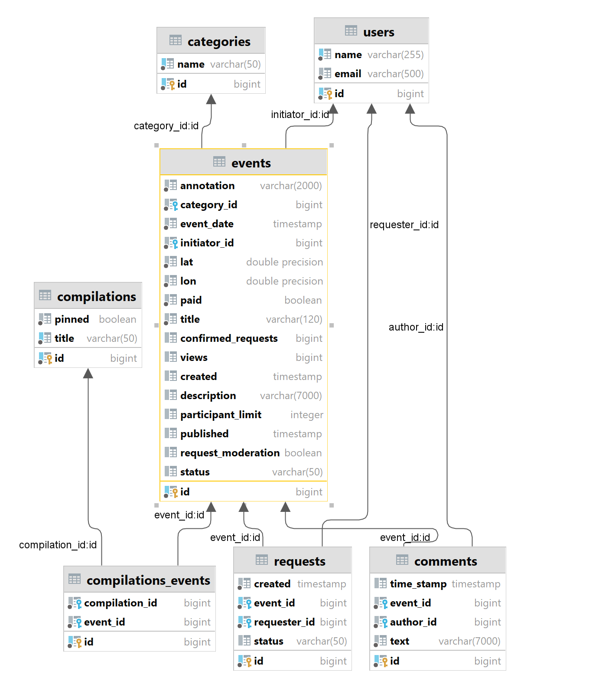
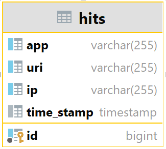

https://github.com/Olhha/java-explore-with-me/pull/5
# java-explore-with-me
-
Проект представляет собой бек-энд Афиши развлекательных событий. 
Пользователи могут предлагать какое-либо событие от выставки до похода в кино и собирать компанию для участия в нём.

Функциональность
-
###  1. Приложение состоит из двух основных модулей: 
* *Основной сервис* - предостваляет пользователям возможность создавать события, подавать заявки на участие в событиях, искать события по определённым фильтрам, просматривать подробную информацию по событию и многое другое.

* *Сервис статистики* - собирает информацию о количестве просмотров списка событий, а так же о количестве запросов к подробной информации о событии. На основе этой информации формируется статистика о работе приложения.

### 2. Приложение имеет три слоя управления (основные функции каждого слоя):
* Публичный:
  - получение списка событий GET /events
  - подробная информация по событию GET /events/{eventId}
  - получение подборок событий  GET /compilations
* Приватный:
  - добавление нового события PUT /users/{userId}/events
  - добавление запроса на участие в чужом событии POST /users/{userId}/requests
* Административный:
  - добавление пользователя POST /admin/users
  - удаление пользователя DELETE /admin/users/{userId}
  - публикация события PATCH /admin/events/{eventId}

### 3. Дополнительная функциональность:
* Пользователь имеет возможность оставлять/редактировать/удалять комментарии к событиям:
  - GET /users/{userId}/events/{eventId}/comments/
  - POST /users/{userId}/events/{eventId}/comments/
  - PATCH /users/{userId}/events/{eventId}/comments/{commentId}
  - DELETE /users/{userId}/events/{eventId}/comments/{commentId}

* Все пользователи могут просматривать комментарии к событиям:
  - GET /events/{eventId}/comments

Описание API
-
* спецификация основного сервиса: [ewm-main-service-spec.json](https://raw.githubusercontent.com/yandex-praktikum/java-explore-with-me/main/ewm-main-service-spec.json)

* спецификация сервиса статистики: [ewm-stats-service.json](https://raw.githubusercontent.com/yandex-praktikum/java-explore-with-me/main/ewm-stats-service-spec.json)

Схема БД
-
    Основной сервис:

-
    Сервер статистики:

